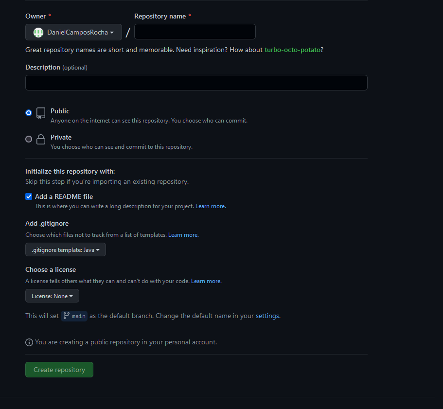
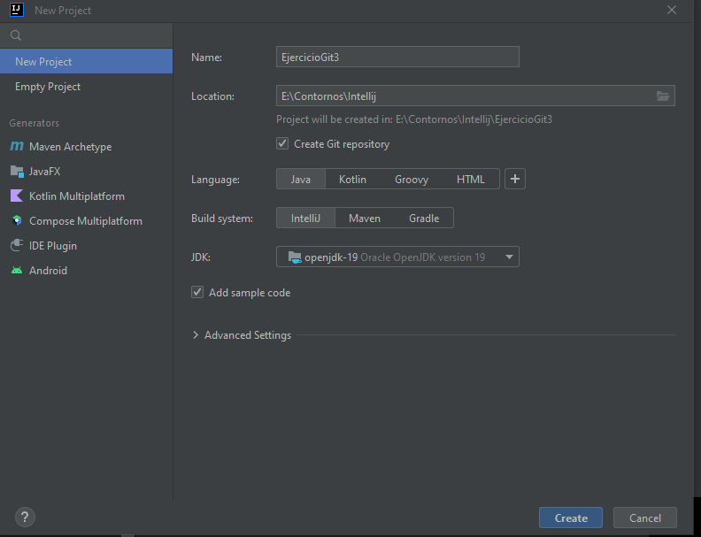
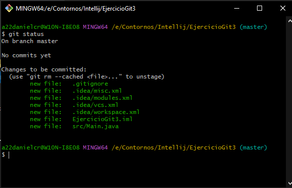
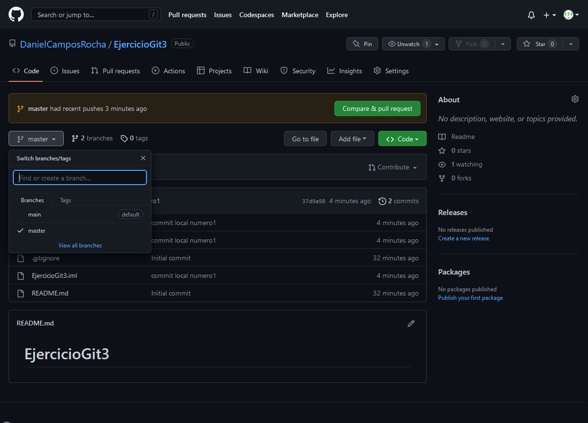
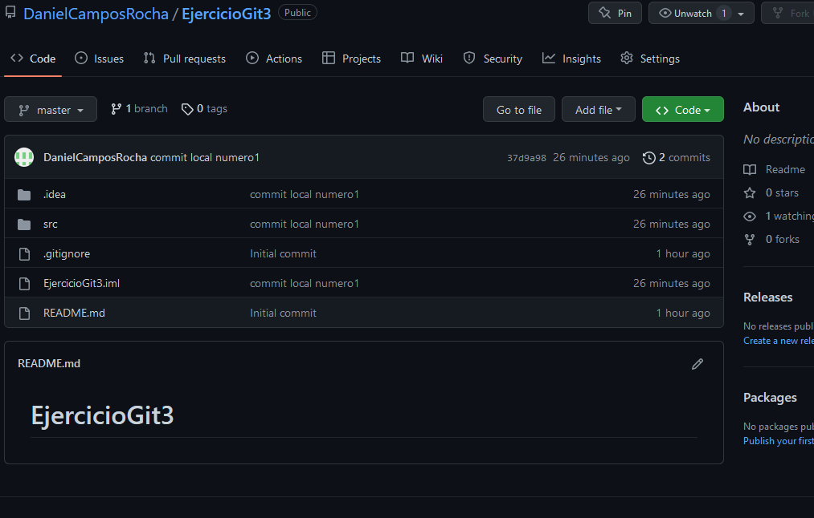

# EjercicioGit3

1-creo el repositorio en github con readme y gitignore

2-creo proyecto en intellij

git remote add origin https://github.com/DanielCamposRocha/EjercicioGit3.git
3-intento hacer un pull, fallo por tener dos ignore
4-aumento los fallos haciendo un git rm --cached -r .
Changes not staged for commit:
(use "git add <file>..." to update what will be committed)
(use "git restore <file>..." to discard changes in working directory)
modified:   .idea/workspace.xml

a22danielcr@W10N-I8E08 MINGW64 /e/Contornos/Intellij/EjercicioGit3 (master)
$ rm .gitignore
5-me cargo el ignore del remoto

a22danielcr@W10N-I8E08 MINGW64 /e/Contornos/Intellij/EjercicioGit3 (master)
$ git status
On branch master

No commits yet

Changes to be committed:
(use "git rm --cached <file>..." to unstage)
new file:   .gitignore
new file:   .idea/misc.xml
new file:   .idea/modules.xml
new file:   .idea/vcs.xml
new file:   .idea/workspace.xml
new file:   EjercicioGit3.iml
new file:   src/Main.java

Changes not staged for commit:
(use "git add/rm <file>..." to update what will be committed)
(use "git restore <file>..." to discard changes in working directory)
deleted:    .gitignore
modified:   .idea/workspace.xml

a22danielcr@W10N-I8E08 MINGW64 /e/Contornos/Intellij/EjercicioGit3 (master)
$ git pull origin main
From https://github.com/DanielCamposRocha/EjercicioGit3
* branch            main       -> FETCH_HEAD
  error: Your local changes to the following files would be overwritten by merge:
  .gitignore
  Please commit your changes or stash them before you merge.
  Aborting

a22danielcr@W10N-I8E08 MINGW64 /e/Contornos/Intellij/EjercicioGit3 (master)
$ git add .
warning: in the working copy of '.idea/workspace.xml', LF will be replaced by CRLF the next time Git touches it

a22danielcr@W10N-I8E08 MINGW64 /e/Contornos/Intellij/EjercicioGit3 (master)
$ git status
On branch master

No commits yet

Changes to be committed:
(use "git rm --cached <file>..." to unstage)
new file:   .idea/misc.xml
new file:   .idea/modules.xml
new file:   .idea/vcs.xml
new file:   .idea/workspace.xml
new file:   EjercicioGit3.iml
new file:   src/Main.java

a22danielcr@W10N-I8E08 MINGW64 /e/Contornos/Intellij/EjercicioGit3 (master)
$ git pull origin main
From https://github.com/DanielCamposRocha/EjercicioGit3
* branch            main       -> FETCH_HEAD

6-Ya tenemos descargado lo que estaba en remoto (el README y el .gitignore de GitHub) en la rama main (rama por defecto en GitHub) a nuestra rama master local.

Ahora commiteamos el proyecto local y lo subimos al repositorio.

a22danielcr@W10N-I8E08 MINGW64 /e/Contornos/Intellij/EjercicioGit3 (master)
$ git add .
warning: in the working copy of '.idea/workspace.xml', LF will be replaced by CRLF the next time Git touches it

a22danielcr@W10N-I8E08 MINGW64 /e/Contornos/Intellij/EjercicioGit3 (master)
$ git commit -m "commit local numero1"
[master 37d9a98] commit local numero1
6 files changed, 93 insertions(+)
create mode 100644 .idea/misc.xml
create mode 100644 .idea/modules.xml
create mode 100644 .idea/vcs.xml
create mode 100644 .idea/workspace.xml
create mode 100644 EjercicioGit3.iml
create mode 100644 src/Main.java

a22danielcr@W10N-I8E08 MINGW64 /e/Contornos/Intellij/EjercicioGit3 (master)
$ git log --oneline
37d9a98 (HEAD -> master) commit local numero1
cbf891a (origin/main) Initial commit

a22danielcr@W10N-I8E08 MINGW64 /e/Contornos/Intellij/EjercicioGit3 (master)
$ git push -u origin master
Enumerating objects: 11, done.
Counting objects: 100% (11/11), done.
Delta compression using up to 4 threads
Compressing objects: 100% (9/9), done.
Writing objects: 100% (10/10), 2.30 KiB | 2.30 MiB/s, done.
Total 10 (delta 0), reused 0 (delta 0), pack-reused 0
remote:
remote: Create a pull request for 'master' on GitHub by visiting:
remote:      https://github.com/DanielCamposRocha/EjercicioGit3/pull/new/master
remote:
To https://github.com/DanielCamposRocha/EjercicioGit3.git
* [new branch]      master -> master
  branch 'master' set up to track 'origin/master'.

a22danielcr@W10N-I8E08 MINGW64 /e/Contornos/Intellij/EjercicioGit3 (master)
$ git log --oneline
37d9a98 (HEAD -> master, origin/master) commit local numero1
cbf891a (origin/main) Initial commit

8-Observamos que se ha subido correctamente pero en la rama master (que era en la que estábamos trabajando en local),
mientras que la rama main se mantiene con su primer commit.

9-Se elimina la rama main en GitHub.
10- Nueva rama para arreglar un fixbug

a22danielcr@W10N-I8E08 MINGW64 /e/Contornos/Intellij/EjercicioGit3 (master)
$ git checkout -b bugfix1
Switched to a new branch 'bugfix1'

a22danielcr@W10N-I8E08 MINGW64 /e/Contornos/Intellij/EjercicioGit3 (bugfix1)
$ git status
On branch bugfix1
Changes not staged for commit:
(use "git add <file>..." to update what will be committed)
(use "git restore <file>..." to discard changes in working directory)
modified:   src/Main.java

no changes added to commit (use "git add" and/or "git commit -a")

a22danielcr@W10N-I8E08 MINGW64 /e/Contornos/Intellij/EjercicioGit3 (bugfix1)
$ git add .
warning: in the working copy of 'src/Main.java', LF will be replaced by CRLF the next time Git touches it

a22danielcr@W10N-I8E08 MINGW64 /e/Contornos/Intellij/EjercicioGit3 (bugfix1)
$ git status
On branch bugfix1
Changes to be committed:
(use "git restore --staged <file>..." to unstage)
modified:   src/Main.java

a22danielcr@W10N-I8E08 MINGW64 /e/Contornos/Intellij/EjercicioGit3 (bugfix1)
$ git commit -m "se supone que el bug fue aplastado"
[bugfix1 22d8ac8] se supone que el bug fue aplastado
1 file changed, 2 insertions(+), 1 deletion(-)

a22danielcr@W10N-I8E08 MINGW64 /e/Contornos/Intellij/EjercicioGit3 (bugfix1)
$ git log --oneline
22d8ac8 (HEAD -> bugfix1) se supone que el bug fue aplastado
fa153ca (master) commit numero 2 en local
37d9a98 (origin/master) commit local numero1
cbf891a (origin/main) Initial commit

a22danielcr@W10N-I8E08 MINGW64 /e/Contornos/Intellij/EjercicioGit3 (bugfix1)
$ git push -u origin bugfix1
Enumerating objects: 15, done.
Counting objects: 100% (15/15), done.
Delta compression using up to 4 threads
Compressing objects: 100% (8/8), done.
Writing objects: 100% (10/10), 981 bytes | 981.00 KiB/s, done.
Total 10 (delta 5), reused 0 (delta 0), pack-reused 0
remote: Resolving deltas: 100% (5/5), completed with 3 local objects.
remote:
remote: Create a pull request for 'bugfix1' on GitHub by visiting:
remote:      https://github.com/DanielCamposRocha/EjercicioGit3/pull/new/bugfix1
remote:
To https://github.com/DanielCamposRocha/EjercicioGit3.git
* [new branch]      bugfix1 -> bugfix1
  branch 'bugfix1' set up to track 'origin/bugfix1'.

a22danielcr@W10N-I8E08 MINGW64 /e/Contornos/Intellij/EjercicioGit3 (bugfix1)
$ git checkout master
Switched to branch 'master'
Your branch is ahead of 'origin/master' by 1 commit.
(use "git push" to publish your local commits)

a22danielcr@W10N-I8E08 MINGW64 /e/Contornos/Intellij/EjercicioGit3 (master)
$ git log
commit fa153ca409023afa9509a8e56b88e96fb3db8b3f (HEAD -> master)
Author: a22danielcr <danielcamposrocha9@gmail.com>
Date:   Mon Nov 21 21:33:00 2022 +0100

    commit numero 2 en local

commit 37d9a988d5adbbe965c95e7ac66111f2f106e707 (origin/master)
Author: a22danielcr <danielcamposrocha9@gmail.com>
Date:   Mon Nov 21 21:04:01 2022 +0100

    commit local numero1

commit cbf891a991082cff60135f90feb9c05fc83101e2 (origin/main)
Author: DanielCamposRocha <114098301+DanielCamposRocha@users.noreply.github.com>
Date:   Mon Nov 21 20:35:50 2022 +0100

    Initial commit

a22danielcr@W10N-I8E08 MINGW64 /e/Contornos/Intellij/EjercicioGit3 (master)
$ git status
On branch master
Your branch is ahead of 'origin/master' by 1 commit.
(use "git push" to publish your local commits)

Changes not staged for commit:
(use "git add <file>..." to update what will be committed)
(use "git restore <file>..." to discard changes in working directory)
modified:   .idea/workspace.xml

no changes added to commit (use "git add" and/or "git commit -a")

a22danielcr@W10N-I8E08 MINGW64 /e/Contornos/Intellij/EjercicioGit3 (master)
$ git add .
warning: in the working copy of '.idea/workspace.xml', LF will be replaced by CRLF the next time Git touches it

a22danielcr@W10N-I8E08 MINGW64 /e/Contornos/Intellij/EjercicioGit3 (master)
$ git status
On branch master
Your branch is ahead of 'origin/master' by 1 commit.
(use "git push" to publish your local commits)

Changes to be committed:
(use "git restore --staged <file>..." to unstage)
modified:   .idea/workspace.xml

a22danielcr@W10N-I8E08 MINGW64 /e/Contornos/Intellij/EjercicioGit3 (master)
$ git commit -m "ni yo se lo que hice"
[master 291ed7d] ni yo se lo que hice
1 file changed, 1 insertion(+), 4 deletions(-)

a22danielcr@W10N-I8E08 MINGW64 /e/Contornos/Intellij/EjercicioGit3 (master)
$ git status
On branch master
Your branch is ahead of 'origin/master' by 2 commits.
(use "git push" to publish your local commits)

nothing to commit, working tree clean

a22danielcr@W10N-I8E08 MINGW64 /e/Contornos/Intellij/EjercicioGit3 (master)
$ git merge bugfix1
Merge made by the 'ort' strategy.
src/Main.java | 3 ++-
1 file changed, 2 insertions(+), 1 deletion(-)

a22danielcr@W10N-I8E08 MINGW64 /e/Contornos/Intellij/EjercicioGit3 (master)
$ git status
On branch master
Your branch is ahead of 'origin/master' by 4 commits.
(use "git push" to publish your local commits)

nothing to commit, working tree clean

a22danielcr@W10N-I8E08 MINGW64 /e/Contornos/Intellij/EjercicioGit3 (master)
$ git push
Enumerating objects: 12, done.
Counting objects: 100% (10/10), done.
Delta compression using up to 4 threads
Compressing objects: 100% (6/6), done.
Writing objects: 100% (6/6), 610 bytes | 610.00 KiB/s, done.
Total 6 (delta 4), reused 0 (delta 0), pack-reused 0
remote: Resolving deltas: 100% (4/4), completed with 3 local objects.
To https://github.com/DanielCamposRocha/EjercicioGit3.git
37d9a98..d78ca1a  master -> master

